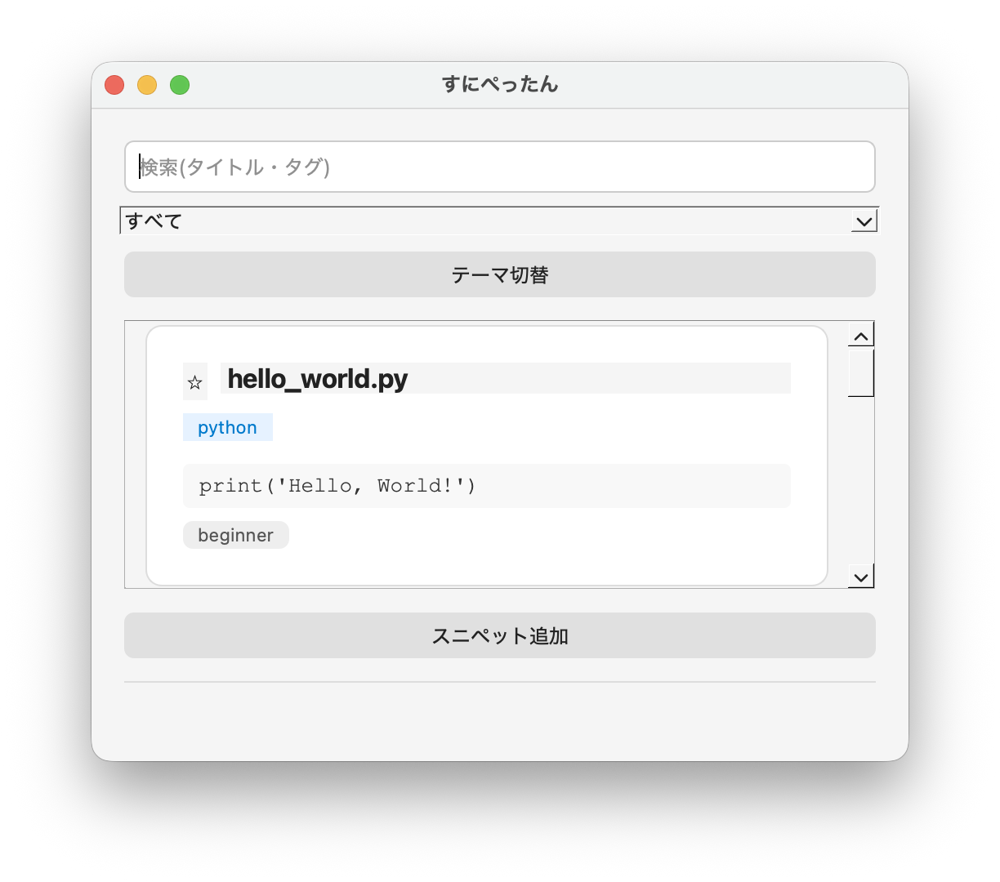
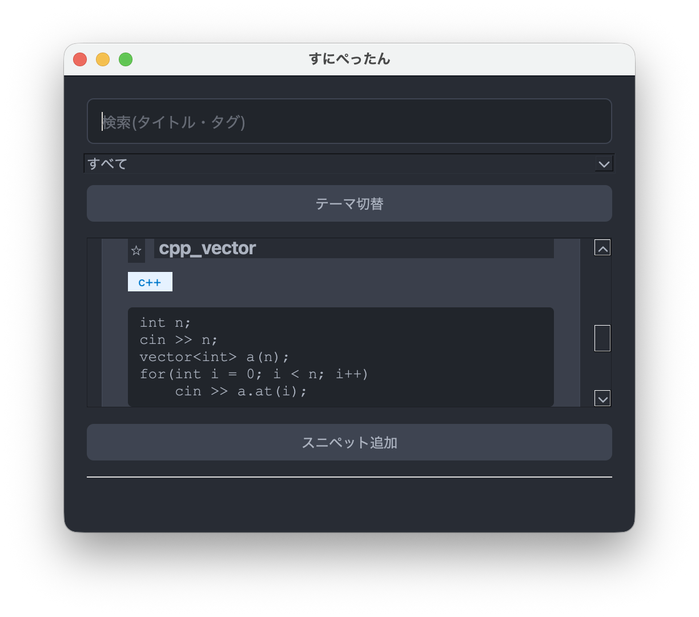
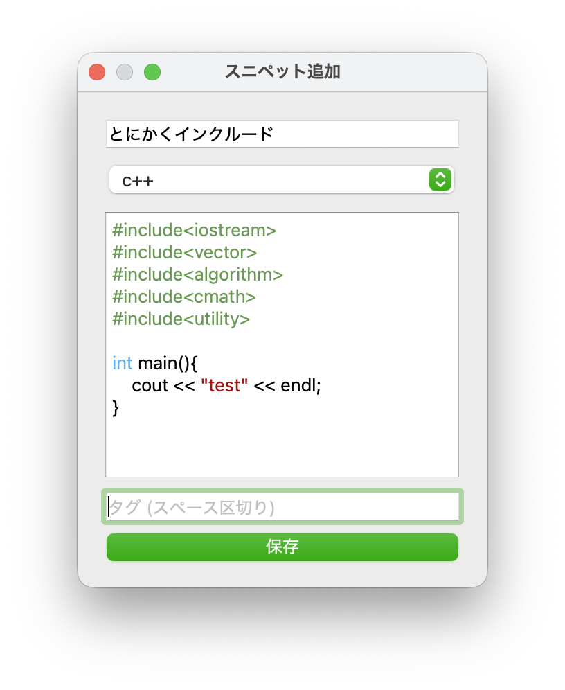

# すにぺったん
コードスニペットをローカルで管理するためのGUIアプリケーションです。

クリックするだけで簡単にスニペットをコピー。
あなたのコーディングをお助けします。

## プレビュー
アプリのアップデートにより、画像が過去のものとなっている場合があります。


メイン画面（ライトテーマ）


メイン画面（ダークテーマ）


スニペット編集画面

## 主な機能
- スニペットの追加
- スニペットの編集
- スニペットの削除
- JSONによるデータ保存
- タグ・タイトルでの検索
- 言語フィルタ
- シンタックスハイライト（性能はお察し）
- お気に入り登録
- ダークテーマ切り替え

## 使用技術
- Python
- PyQt6

## ライセンス
このプロジェクトは GPL-3.0 License のもとで公開しています。

本アプリケーションでは PyQt6 を使用しています。
PyQt6 は GPL v3 または商用ライセンスで提供されています。

## 起動方法
本ディレクトリの階層構造を維持したまま、
```bash
pip install PyQt6 (インストール済みの場合はスキップ可)

python main.py
```

## 今後の予定(2026/06/11更新)
- ダークモードの見た目整える
- 並び替え機能の実装
- スニペットの投稿・ダウンロード機能の実装